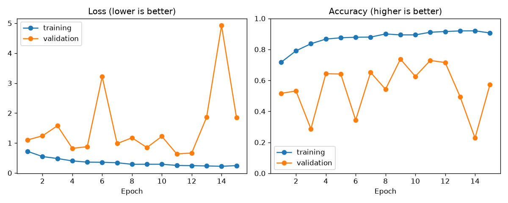
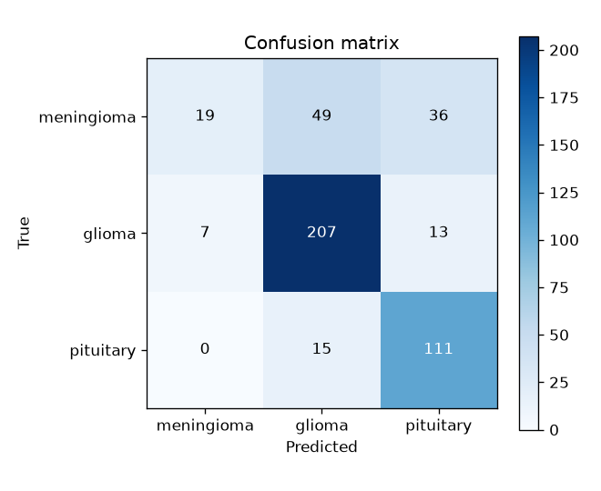
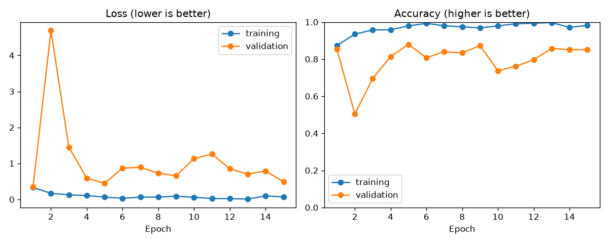
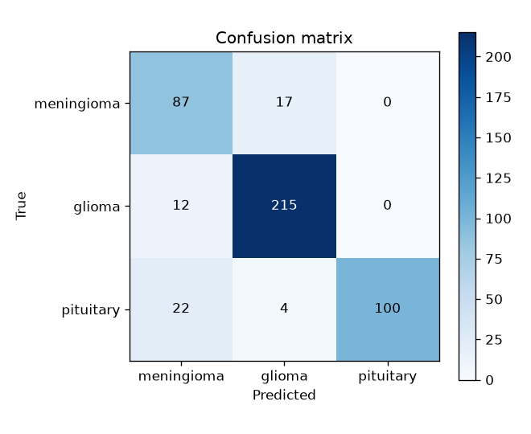
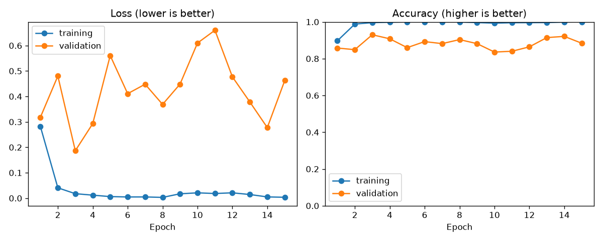
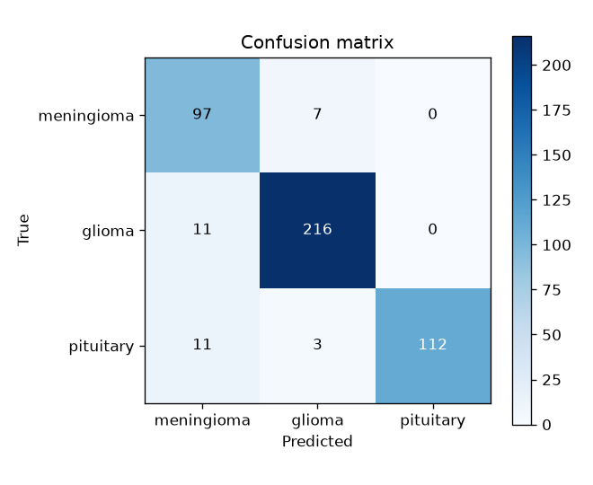

# Brain Tumour MRI Classifier

Classifying brain tumour type (glioma, meningioma, pituitary) from MRI slices with deep learning, built step by step to understand how the model learns, and where its results can mislead.

> **Status:** in progress. Experiments 1–3 complete (baseline CNN, then pretrained ResNet-18); augmentation, the final test-set score, heatmaps and a live demo are next.
> **Educational project, not a medical device, not for diagnosis.**

## Why this project

During my internship at Siemens working on MRI, I learned that AI is being used both to shorten scan times and to help clinicians detect cancer. This project explores that from the ground up: training a model on real MRI data, and asking not just "how accurate is it?" but "can that number be trusted?"

## Data

- **Source:** 3,064 contrast-enhanced T1-weighted MRI slices from 233 patients (Cheng et al.). Glioma: 1,426 · Meningioma: 708 · Pituitary: 930.
- **Split by patient, not by slice:** 165 / 34 / 34 patients into training / validation / test (70% / 15% / 15%, stratified by tumour type). No patient appears in more than one set; an automated test enforces this. Splitting by slice would let the model see near-identical neighbouring slices of a test patient during training, which inflates the score.
- **Class imbalance:** there are twice as many gliomas as meningiomas. The loss is weighted so rarer types aren't ignored, and results are reported per type.

## Experiments

| # | Model | LR | Val accuracy | Meningioma recall | Val accuracy spread |
|---|---|---|---|---|---|
| 1 | SmallCNN from scratch | 1e-3 | 73.7% | 0.18 | 51 points |
| 2 | ResNet-18 pretrained | 1e-3 | 88.0% | 0.84 | 38 points |
| 3 | ResNet-18 fine-tuned | 1e-4 | **93.0%** | **0.93** | **9 points** |

"Spread" is the gap between the best and worst validation accuracy across the 15 epochs — a rough measure of how unstable training was. Everything else (data, split, 15 epochs, batch size 32, Adam, seed, class weights, no augmentation) is identical across all three runs.

Swapping the from-scratch SmallCNN for an ImageNet-pretrained ResNet-18 lifted validation accuracy from 74% to 88% and meningioma recall from 0.18 to 0.84. That swap changed the architecture and the starting weights together, so it shows the pretrained ResNet-18 is better, not how much of the gain is pretraining alone. Cutting the learning rate tenfold was a clean one-variable change: the spread fell from 38 points to 9, and the best-accuracy and best-loss epochs now agree (both epoch 3), so the 93% is no longer a lucky peak on a noisy curve. Experiment 3 is the model carried into the next stage.

### Experiment 1: small CNN from scratch

A 4-block convolutional network (98,019 parameters) trained only on these scans for 15 epochs on a laptop CPU, roughly 1–2 minutes per epoch.

**Validation results** (best epoch 9, 457 scans; the test set is untouched until the final model is chosen):

| Tumour type | Precision | Recall |
|---|---|---|
| Glioma | 0.76 | 0.91 |
| Meningioma | 0.73 | 0.18 |
| Pituitary | 0.69 | 0.88 |

Overall validation accuracy: 73.7%.

**What this shows.** The model learned something real, but not evenly. Training accuracy climbed steadily to 92% while validation accuracy bounced between 23% and 74% from epoch to epoch — a network with 98k parameters memorising ~2,100 training slices rather than learning tumour appearance in general. Almost all of the error is one class: meningioma recall is 0.18, meaning it catches 19 of 104 meningiomas and misfiles 49 as glioma and 36 as pituitary, while glioma (0.91) and pituitary (0.88) are largely fine. The headline 73.7% also deserves an asterisk: the checkpoint is chosen as the best of 15 noisy validation readings, so some of that peak is luck rather than skill — epoch 11 had a clearly better loss (0.64 vs 0.85) but a lower accuracy. The next experiment tests whether a pretrained ResNet-18, which starts with edge and texture detectors learned from millions of images, steadies that curve and rescues meningioma.

### Experiment 2: pretrained ResNet-18, learning rate unchanged

ResNet-18 (11 million parameters) starting from ImageNet weights, with every layer fine-tuned. The greyscale slice is repeated into three channels and scaled by ImageNet's mean and standard deviation inside the model. The learning rate was deliberately left at experiment 1's 1e-3, so that only the model changed. Roughly 3.5 minutes per epoch on the same laptop CPU.

**Validation results** (best epoch 5, 457 scans):

| Tumour type | Precision | Recall |
|---|---|---|
| Glioma | 0.91 | 0.95 |
| Meningioma | 0.72 | 0.84 |
| Pituitary | 1.00 | 0.79 |

Overall validation accuracy: 88.0%.

**What this shows.** A large jump — meningioma went from 19 of 104 caught to 87. But the curve is still unstable: epoch 1 already scored 85%, then epoch 2 fell to 50% with a validation loss of 4.7 while training accuracy kept rising. The lowest validation loss came at epoch 1, not the chosen epoch 5, so the two ways of calling an epoch "best" disagree again.

### Experiment 3: ResNet-18 fine-tuned at a lower learning rate

Identical to experiment 2 except the learning rate: 1e-4 instead of 1e-3, the usual choice when adjusting pretrained weights rather than shaping random ones.

**Validation results** (best epoch 3, 457 scans):

| Tumour type | Precision | Recall |
|---|---|---|
| Glioma | 0.96 | 0.95 |
| Meningioma | 0.82 | 0.93 |
| Pituitary | 1.00 | 0.89 |

Overall validation accuracy: 93.0%.

**What this shows.** Validation accuracy stayed between 84% and 93% across all 15 epochs, with no collapse, and the best-accuracy and best-loss epochs coincide. Meningioma is now caught 97 times out of 104. Two things remain:

- **The model now leans towards meningioma.** It is the most common wrong answer — 11 gliomas and 11 pituitary tumours were called meningioma — so meningioma precision (0.82) is now the weakest score.
- **It still overfits.** Training accuracy reached 100% by epoch 5 and validation loss rose after epoch 3. Data augmentation, the next experiment, targets exactly this.

**Why the curve steadied is not fully pinned down.** In the unstable runs, the worst epochs look like the model predicting nearly one class: experiment 1's 22.8% is exactly the share of meningiomas in the validation set, and experiment 2's 50.3% sits next to the glioma share (49.7%), all while training accuracy stayed high. A learning rate that is too large can cause that by overshooting, but so can BatchNorm layers whose stored averages lag behind rapidly changing weights, which only bites in evaluation mode. A smaller learning rate fixes both, so these runs show the fix works without isolating the cause.

All three accuracies are validation scores, used to choose between models, and therefore slightly optimistic. The test set stays untouched until the final model is chosen and will be scored once.

## Limitations

- Single 2D slices, not full 3D scans.
- One dataset, collected at two hospitals in China between 2005 and 2010; performance elsewhere is unknown.
- Only three tumour types; the model cannot say "no tumour".
- Not clinically validated.

## How to run

Requires Windows with Python 3.13.

    py -3.13 -m venv .venv
    .\.venv\Scripts\python.exe -m pip install -r requirements.txt
    .\.venv\Scripts\python.exe -m pytest
    .\.venv\Scripts\python.exe -m src.download
    .\.venv\Scripts\python.exe -m src.train --name 01-small-cnn --model small_cnn --epochs 15
    .\.venv\Scripts\python.exe -m src.train --name 02-resnet18-lr1e-3 --model resnet18 --epochs 15 --lr 1e-3
    .\.venv\Scripts\python.exe -m src.train --name 03-resnet18-finetuned --model resnet18 --epochs 15 --lr 1e-4

The first ResNet-18 run downloads its ImageNet weights (~45 MB) once.

## Data citation

Cheng, Jun (2017). *brain tumor dataset*. figshare. https://doi.org/10.6084/m9.figshare.1512427 (CC BY 4.0).
Cheng, J. et al. (2015). Enhanced Performance of Brain Tumor Classification via Tumor Region Augmentation and Partition. *PLoS ONE* 10(10).
