# Brain Tumour MRI Classifier

Classifying brain tumour type (glioma, meningioma, pituitary) from MRI slices with deep learning, built step by step to understand how the model learns, and where its results can mislead.

> **Status:** in progress. Experiments 1–4, the one-shot test score and the Grad-CAM analysis are complete; a live demo is next.
> **Educational project, not a medical device, not for diagnosis.**

**Result:** 90.9% test accuracy (patient-level split, scored once); meningioma remains the hardest type at 0.76 recall. [Details below.](#final-test-results)

## Why this project

During my internship at Siemens working on MRI, I learned that AI is being used both to shorten scan times and to help clinicians detect cancer. This project explores that from the ground up: training a model on real MRI data, and asking not just "how accurate is it?" but "can that number be trusted?"

## Data

- **Source:** 3,064 contrast-enhanced T1-weighted MRI slices from 233 patients (Cheng et al.). Glioma: 1,426 · Meningioma: 708 · Pituitary: 930.
- **Split by patient, not by slice:** 165 / 34 / 34 patients into training / validation / test (70% / 15% / 15%, stratified by tumour type). No patient appears in more than one set; an automated test enforces this. Splitting by slice would let the model see near-identical neighbouring slices of a test patient during training, which inflates the score.
- **Class imbalance:** there are twice as many gliomas as meningiomas. The loss is weighted so rarer types aren't ignored, and results are reported per type.

## Experiments

| # | Model | LR | Val accuracy | Meningioma recall | Val accuracy spread |
|---|---|---|---|---|---|
| 1 | SmallCNN from scratch | 1e-3 | 73.7% | 0.18 | 51 points |
| 2 | ResNet-18 pretrained | 1e-3 | 88.0% | 0.84 | 38 points |
| 3 | ResNet-18 fine-tuned | 1e-4 | **93.0%** | **0.93** | **9 points** |
| 4 | ResNet-18 fine-tuned + augmentation | 1e-4 | 94.1% | 0.94 | 12 points |

"Spread" is the gap between the best and worst validation accuracy across the 15 epochs — a rough measure of how unstable training was. Everything else (data, split, 15 epochs, batch size 32, Adam, seed, class weights) is identical across all four runs; only experiment 4 uses augmentation.

Swapping the from-scratch SmallCNN for an ImageNet-pretrained ResNet-18 lifted validation accuracy from 74% to 88% and meningioma recall from 0.18 to 0.84. That swap changed the architecture and the starting weights together, so it shows the pretrained ResNet-18 is better, not how much of the gain is pretraining alone. Cutting the learning rate tenfold was a clean one-variable change: the spread fell from 38 points to 9, and the best-accuracy and best-loss epochs now agree (both epoch 3), so the 93% is no longer a lucky peak on a noisy curve. Augmentation (experiment 4) added 1.1 points, short of the 2-point margin set in advance, so experiment 3 is the final model (see [Final test results](#final-test-results)).

### Experiment 1: small CNN from scratch

A 4-block convolutional network (98,019 parameters) trained only on these scans for 15 epochs on a laptop CPU, roughly 1–2 minutes per epoch.

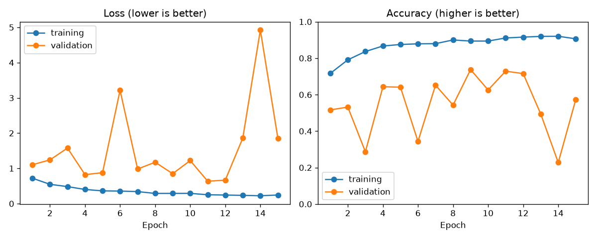

**Validation results** (best epoch 9, 457 scans; the test set is untouched until the final model is chosen):

| Tumour type | Precision | Recall |
|---|---|---|
| Glioma | 0.76 | 0.91 |
| Meningioma | 0.73 | 0.18 |
| Pituitary | 0.69 | 0.88 |

Overall validation accuracy: 73.7%.

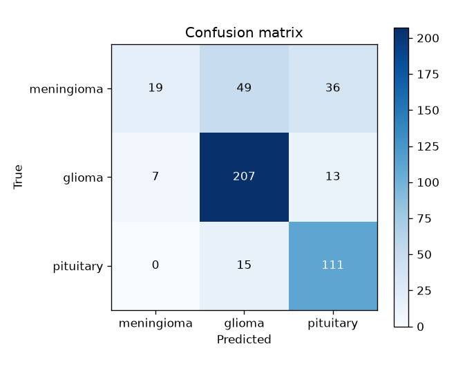

**What this shows.** The model learned something real, but not evenly. Training accuracy climbed steadily to 92% while validation accuracy bounced between 23% and 74% from epoch to epoch — a network with 98k parameters memorising ~2,100 training slices rather than learning tumour appearance in general. Almost all of the error is one class: meningioma recall is 0.18, meaning it catches 19 of 104 meningiomas and misfiles 49 as glioma and 36 as pituitary, while glioma (0.91) and pituitary (0.88) are largely fine. The headline 73.7% also deserves an asterisk: the checkpoint is chosen as the best of 15 noisy validation readings, so some of that peak is luck rather than skill — epoch 11 had a clearly better loss (0.64 vs 0.85) but a lower accuracy. The next experiment tests whether a pretrained ResNet-18, which starts with edge and texture detectors learned from millions of images, steadies that curve and rescues meningioma.

### Experiment 2: pretrained ResNet-18, learning rate unchanged

ResNet-18 (11 million parameters) starting from ImageNet weights, with every layer fine-tuned. The greyscale slice is repeated into three channels and scaled by ImageNet's mean and standard deviation inside the model. The learning rate was deliberately left at experiment 1's 1e-3, so that only the model changed. Roughly 3.5 minutes per epoch on the same laptop CPU.

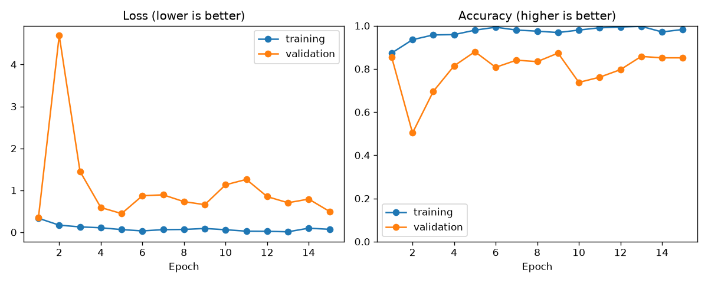

**Validation results** (best epoch 5, 457 scans):

| Tumour type | Precision | Recall |
|---|---|---|
| Glioma | 0.91 | 0.95 |
| Meningioma | 0.72 | 0.84 |
| Pituitary | 1.00 | 0.79 |

Overall validation accuracy: 88.0%.

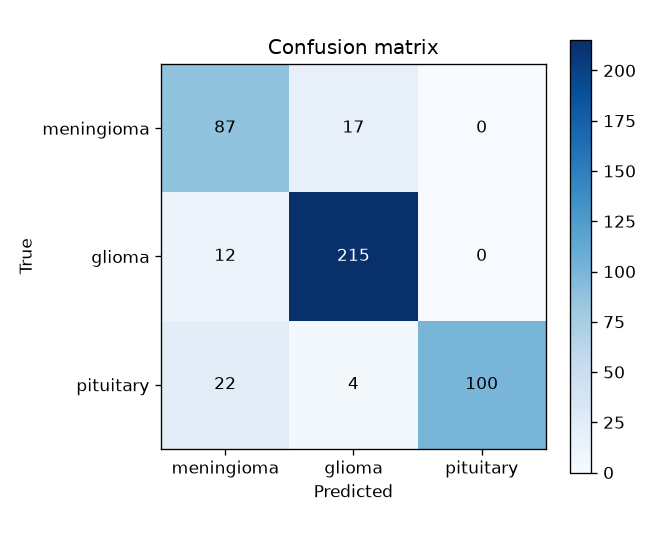

**What this shows.** A large jump — meningioma went from 19 of 104 caught to 87. But the curve is still unstable: epoch 1 already scored 85%, then epoch 2 fell to 50% with a validation loss of 4.7 while training accuracy kept rising. The lowest validation loss came at epoch 1, not the chosen epoch 5, so the two ways of calling an epoch "best" disagree again.

### Experiment 3: ResNet-18 fine-tuned at a lower learning rate

Identical to experiment 2 except the learning rate: 1e-4 instead of 1e-3, the usual choice when adjusting pretrained weights rather than shaping random ones.

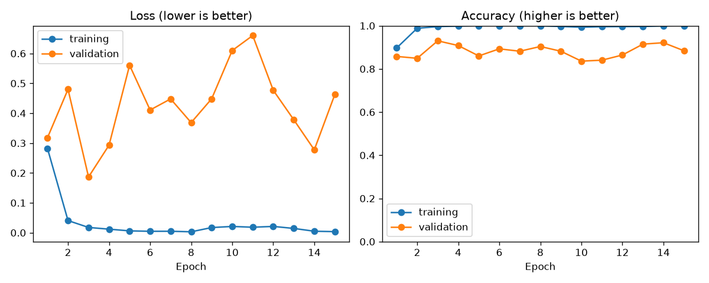

**Validation results** (best epoch 3, 457 scans):

| Tumour type | Precision | Recall |
|---|---|---|
| Glioma | 0.96 | 0.95 |
| Meningioma | 0.82 | 0.93 |
| Pituitary | 1.00 | 0.89 |

Overall validation accuracy: 93.0%.

**What this shows.** Validation accuracy stayed between 84% and 93% across all 15 epochs, with no collapse, and the best-accuracy and best-loss epochs coincide. Meningioma is now caught 97 times out of 104. Two things remain:

- **The model now leans towards meningioma.** It is the most common wrong answer — 11 gliomas and 11 pituitary tumours were called meningioma — so meningioma precision (0.82) is now the weakest score.
- **It still overfits.** Training accuracy reached 100% by epoch 5 and validation loss rose after epoch 3. Data augmentation, the next experiment, targets exactly this.

**Why the curve steadied is not fully pinned down.** In the unstable runs, the worst epochs look like the model predicting nearly one class: experiment 1's 22.8% is exactly the share of meningiomas in the validation set, and experiment 2's 50.3% sits next to the glioma share (49.7%), all while training accuracy stayed high. A learning rate that is too large can cause that by overshooting, but so can BatchNorm layers whose stored averages lag behind rapidly changing weights, which only bites in evaluation mode. A smaller learning rate fixes both, so these runs show the fix works without isolating the cause.

### Experiment 4: adding augmentation

Identical to experiment 3, except each training scan is randomly changed every time it is used: mirrored left-right half the time, rotated up to 10° (smoothly, so edges stay natural), and brightness and contrast shifted up to 10%. Validation scans are never changed. No vertical flips, because an upside-down brain never comes out of a scanner.

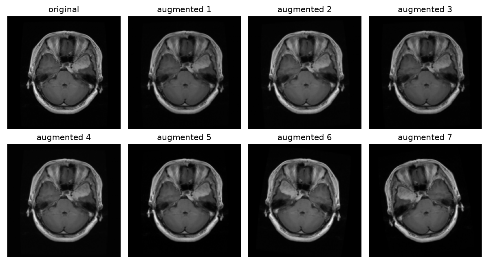

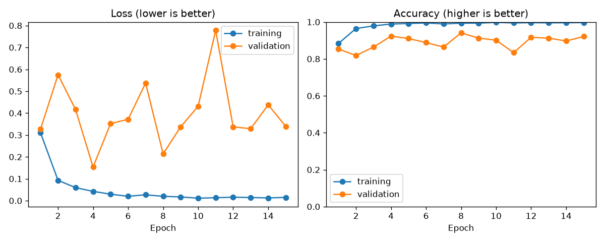

**Validation results** (best epoch 8, 457 scans):

| Tumour type | Precision | Recall |
|---|---|---|
| Glioma | 0.96 | 0.94 |
| Meningioma | 0.84 | 0.94 |
| Pituitary | 1.00 | 0.94 |

Overall validation accuracy: 94.1%.

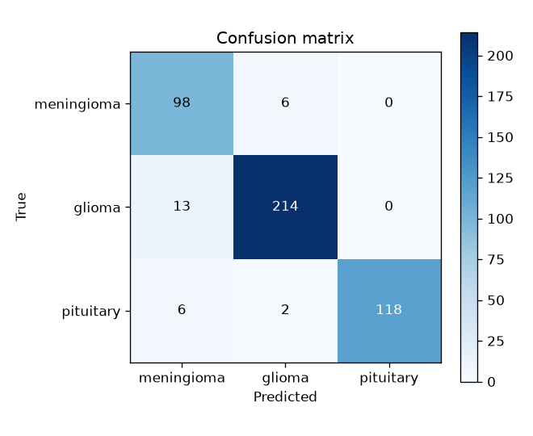

**What this shows.** Augmentation made 27 mistakes where experiment 3 made 32, with pituitary recall improving most (0.89 → 0.94), and it reached the lowest validation loss of any run (0.154). But it barely slowed memorisation — training accuracy still passed 99% by epoch 5 — and its curve was slightly less steady (a 12-point spread, and the best-accuracy and best-loss epochs disagree: 8 against 4). A 1.1-point gain is smaller than the epoch-to-epoch swings, so this is a small improvement that one run cannot confirm, not a clear win.

All four accuracies above are validation scores, used to choose between models, and therefore slightly optimistic.

## Final test results

**The rule, written before experiment 4 ran:** experiment 4 would become the final model only if it beat experiment 3's 93.0% validation accuracy by at least 2 points (≥ 95.0%); otherwise experiment 3 would. A smaller margin is within epoch-to-epoch noise, and a tie goes to the simpler model. Experiment 4 scored 94.1%, so the final model is **experiment 3** (pretrained ResNet-18, fine-tuned at learning rate 1e-4, no augmentation).

That model was then scored **once** on the 34 test patients (430 scans) that had played no part in any decision. Before scoring, reloading the saved model reproduced its validation result exactly. The code refuses a second test score.

| Tumour type | Precision | Recall |
|---|---|---|
| Glioma | 0.93 | 0.94 |
| Meningioma | 0.77 | 0.76 |
| Pituitary | 0.95 | 0.95 |

**Test accuracy: 90.9%** (validation: 93.0%).

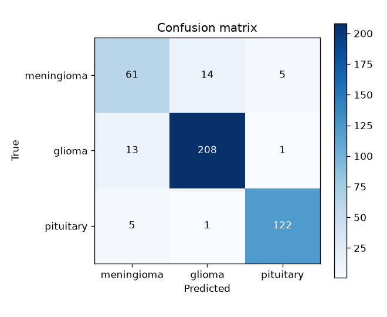

The 2-point drop from validation is expected: every choice — which epoch, which learning rate, which model — was made by looking at validation, so validation was slightly tuned in the model's favour, while the test patients influenced nothing. Glioma and pituitary held up (0.94 and 0.95 recall). Meningioma did not: 61 of 80 caught, with most misses called glioma, against 0.93 recall on validation. It was the class that got the most attention during development, so its validation score was the most flattered — which is exactly why a separate test set is kept. The 80 meningioma slices come from only a handful of patients, so a few hard patients may account for most of the misses; the sections below look at where the model looks and which patients the mistakes come from.

## Where the model looks

Grad-CAM, written by hand in `src/explain.py`, turns each decision into a heatmap of where the evidence came from, taken from ResNet-18's last convolutional stage. It was run on all 430 test scans after the test score was final; nothing found here was used to change the model.

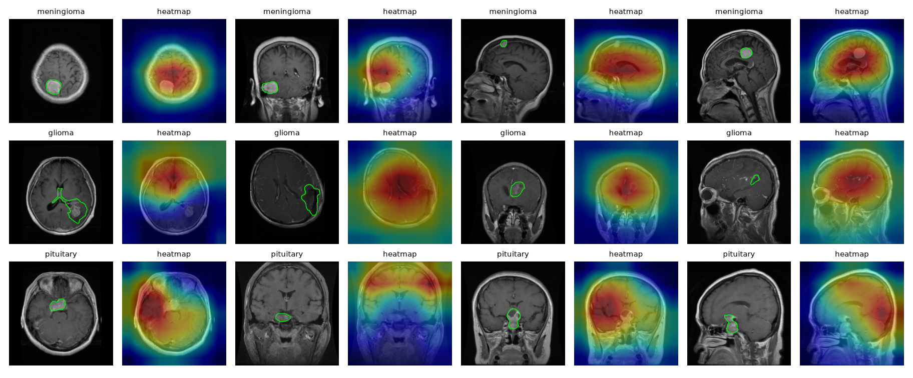

*Random correctly classified test scans (seed 0, not hand-picked): tumour outline in green, then the heatmap — red is where the evidence came from.*

**Measuring it.** The original plan was to call a scan "focused" if at least half the heatmap fell inside the clinicians' tumour outline. The data rules that out: tumours cover a median of 0.7–1.6% of the image, while each cell of ResNet-18's 7×7 heatmap covers about 2%, so even perfectly placed attention spills far outside the outline. Two measures that fit, each with the score luck alone would give:

- **Pointing game:** is the heatmap's hottest pixel on the tumour (within 8 pixels)?
- **In-mask share:** what fraction of the heatmap falls inside the outline?

| | Scans | Pointing game | Luck | In-mask share | Luck | × luck |
|---|---|---|---|---|---|---|
| All test scans | 430 | 19.8% | 4.0% | 2.5% | 1.5% | 1.7 |
| Correct answers | 391 | 20.7% | 4.0% | 2.6% | 1.5% | 1.7 |
| Wrong answers | 39 | 10.3% | 3.7% | 2.2% | 1.3% | 1.7 |
| Meningioma | 80 | 13.8% | 3.5% | 2.8% | 1.2% | 2.3 |
| Glioma | 222 | 32.9% | 4.7% | 3.3% | 1.9% | 1.8 |
| Pituitary | 128 | **0.8%** | 2.9% | 1.1% | 0.9% | 1.2 |

The model does use the tumour region — its peak lands there five times more often than luck — but only one scan in five, and the example heatmaps are broad blobs over the centre of the brain. Some of that blur is the coarse 7×7 grid; not all of it. When the model is wrong, its peak lands on the tumour half as often as when it is right. **Pituitary is the striking case:** the model catches 95% of pituitary tumours on test, yet its peak lands on the tumour *less* often than luck would. It is recognising pituitary cases by something other than the tumour itself. A likely explanation is the slice's position in the head — pituitary tumours sit in one fixed place at the base of the brain, so their scans show the same central anatomy — but these results suggest that shortcut rather than prove it.

## Mistakes

All 39 wrong test answers, grouped by true type. Titles give the model's answer, its confidence and the patient; red titles are confident mistakes (confidence ≥ 0.9): 16 of them.

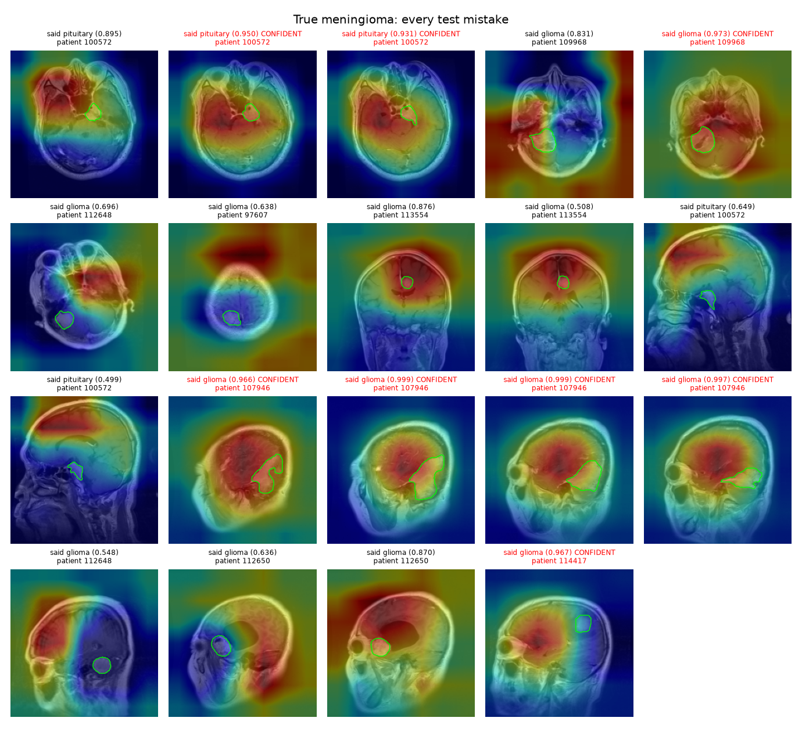
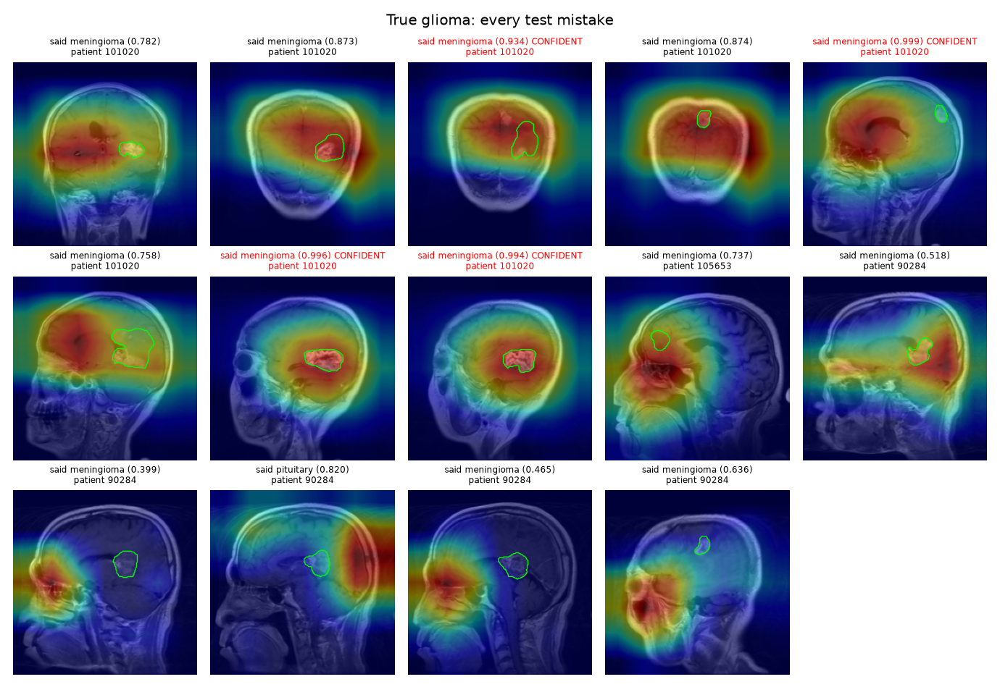
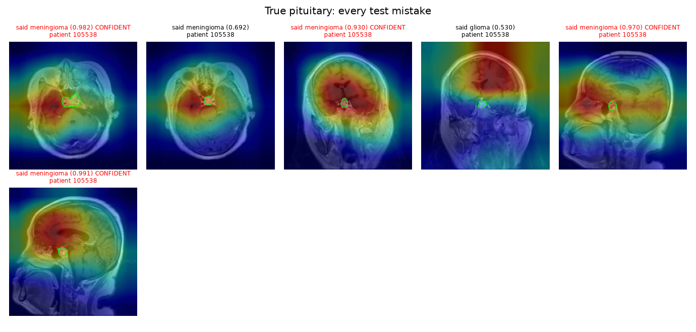

**Meningioma misses by patient:**

| Patient | Slices | Wrong | Mostly called |
|---|---|---|---|
| 100572 | 8 | 5 | pituitary |
| 107946 | 4 | 4 | glioma |
| 109968 | 12 | 2 | glioma |
| 112648 | 10 | 2 | glioma |
| 112650 | 2 | 2 | glioma |
| 113554 | 10 | 2 | glioma |
| 114417 | 4 | 1 | glioma |
| 97607 | 12 | 1 | glioma |

The mistakes cluster: 28 of the 39 come from 5 of the 34 test patients. Every pituitary mistake is one patient (105538, 6 of 7 slices, mostly called meningioma), and 13 of the 14 glioma mistakes are two patients (101020 and 90284). Meningioma is more mixed: 9 of its 19 misses are two patients, the other 10 are spread across six. Two cases stand out. Patient 100572's meningioma sits near the centre of the skull base, where pituitary tumours sit, and the model called it pituitary — what a location shortcut would predict. Patient 107946's large meningioma was called glioma on all four slices at 97–100% confidence. And for glioma patient 90284, four of the five wrong heatmaps peak on the eyes and face, outside the brain entirely. The model's confidence is not a reliable warning sign on its hardest cases.

## Limitations

- Single 2D slices, not full 3D scans.
- One dataset, collected at two hospitals in China between 2005 and 2010; performance elsewhere is unknown.
- Only three tumour types; the model cannot say "no tumour".
- The model does not reliably base its answer on the tumour itself, and pituitary cases show signs of a location shortcut (see [Where the model looks](#where-the-model-looks)).
- Its confidence is not a reliable warning: 16 of 39 test mistakes were made at 90% confidence or more.
- Not clinically validated.

## How to run

Requires Windows with Python 3.13.

    py -3.13 -m venv .venv
    .\.venv\Scripts\python.exe -m pip install -r requirements.txt
    .\.venv\Scripts\python.exe -m pytest
    .\.venv\Scripts\python.exe -m src.download
    .\.venv\Scripts\python.exe -m src.train --name 01-small-cnn --model small_cnn --epochs 15
    .\.venv\Scripts\python.exe -m src.train --name 02-resnet18-lr1e-3 --model resnet18 --epochs 15 --lr 1e-3
    .\.venv\Scripts\python.exe -m src.train --name 03-resnet18-finetuned --model resnet18 --epochs 15 --lr 1e-4
    .\.venv\Scripts\python.exe -m src.train --name 04-resnet18-augment --model resnet18 --epochs 15 --lr 1e-4 --augment
    .\.venv\Scripts\python.exe -m src.score --name 03-resnet18-finetuned --split validation
    .\.venv\Scripts\python.exe -m src.score --name 03-resnet18-finetuned --split test
    .\.venv\Scripts\python.exe -m src.explain --name 03-resnet18-finetuned

The first ResNet-18 run downloads its ImageNet weights (~45 MB) once.

## Data citation

Cheng, Jun (2017). *brain tumor dataset*. figshare. https://doi.org/10.6084/m9.figshare.1512427 (CC BY 4.0).
Cheng, J. et al. (2015). Enhanced Performance of Brain Tumor Classification via Tumor Region Augmentation and Partition. *PLoS ONE* 10(10).
